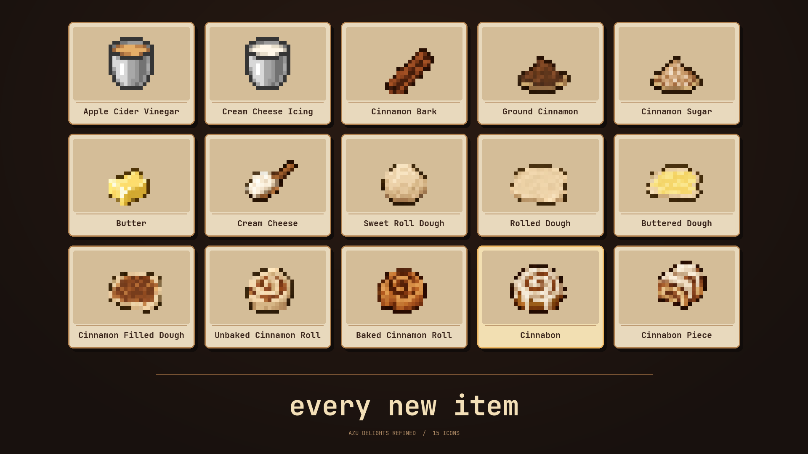

# Azu Delights Refined

Azu Delights Refined is a KubeJS add-on for Create that adds a complete real life cinnamon roll production line. It takes you from cinnamon bark and sweet dough through rolling, filling, baking, and cream cheese icing. The finished Cinnabon is an edible item.

The add-on includes 13 custom items, two fluids, 16 recipes. All custom registry IDs use the `azudelightsrefined` namespace.

## Showcase

[Watch the showcase on YouTube](https://youtu.be/4OKDzXo4t-k)

## New items



## Requirements and installation

Made for the **Just Create SMP 2** pack using **KubeJS** and **Create**. Copy the contents of this repository's `kubejs/` directory into your instance's `kubejs/` directory, keeping the `startup_scripts`, `server_scripts`, and `assets` paths intact. Restart the game so KubeJS can register the items and fluids.

## Recipe tree

The quantities below describe one run of each recipe. `mB` means millibuckets. Wheat flour comes from Create's existing wheat milling recipe.

```text
Jungle log
  ├─ Create Cutting → 1 cinnamon bark + 1 stripped jungle log
  └─ Create Crushing → 2 cinnamon bark + 2 sticks

1 cinnamon bark ─ Create Milling → 1 ground cinnamon
1 ground cinnamon + 1 sugar ─ Create Mixing → 2 cinnamon sugar

500 mB milk ─ Create Mixing → 2 butter
1 apple + 250 mB water ─ Create Mixing → 250 mB apple cider vinegar
500 mB milk + 250 mB apple cider vinegar
  └─ Create Mixing, heated → 2 cream cheese

Wheat ─ Create Milling → wheat flour (Create's built-in recipe)
2 wheat flour + 1 egg + 1 sugar + 1 butter + 250 mB milk
  └─ Create Mixing → 2 sweet roll dough

1 sweet roll dough ─ Create Pressing → 1 rolled dough
1 rolled dough + 1 butter ─ Create Deploying → 1 buttered dough
1 buttered dough + 1 cinnamon sugar ─ Create Deploying → 1 filled dough
1 filled dough ─ Create Cutting → 2 unbaked cinnamon rolls
1 unbaked cinnamon roll ─ Smoking → 1 baked cinnamon roll

250 mB milk + 1 cream cheese + 2 sugar
  └─ Create Mixing → 250 mB cream cheese icing
1 baked cinnamon roll + 250 mB cream cheese icing
  └─ Create Filling → 1 Cinnabon
1 Cinnabon ─ Create Cutting → 4 Cinnabon pieces
```

The two bark recipes are alternatives. The dough recipe makes two portions, while each pressing, filling, and baking step processes one portion at a time. Icing uses the fluid ID `azudelightsrefined:sweet_icing` and appears in game as **Cream Cheese Icing**.

## Files

- `kubejs/startup_scripts/azudelightsrefined/` registers items and fluids.
- `kubejs/server_scripts/azudelightsrefined/` defines the recipes.
- `kubejs/assets/azudelightsrefined/` contains item models and textures.

made by ycangignacy for JSC2
